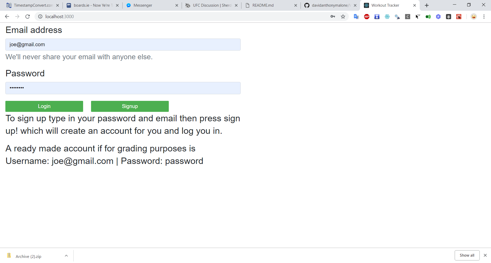
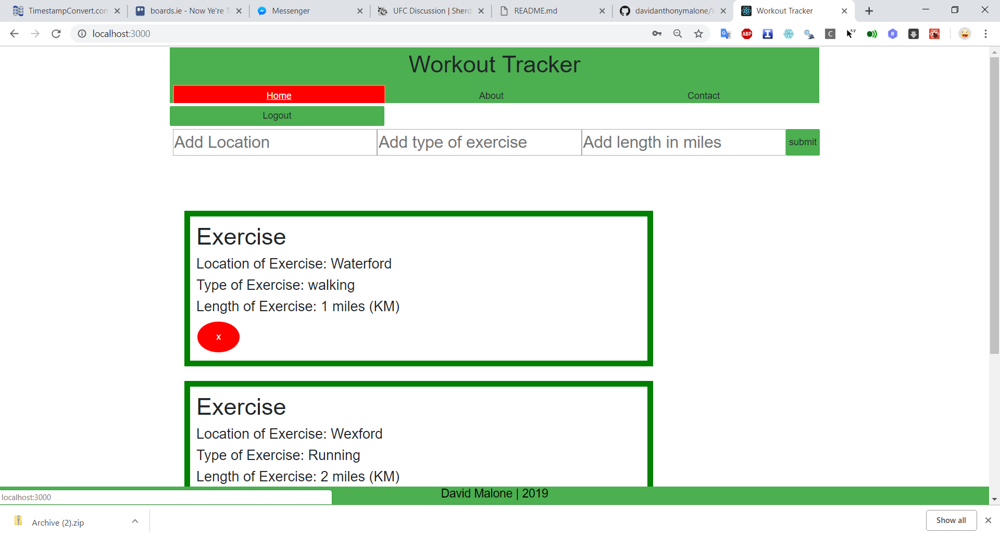
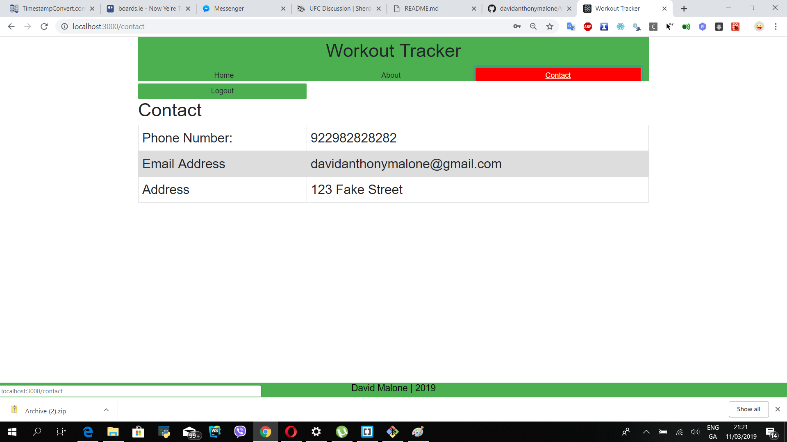
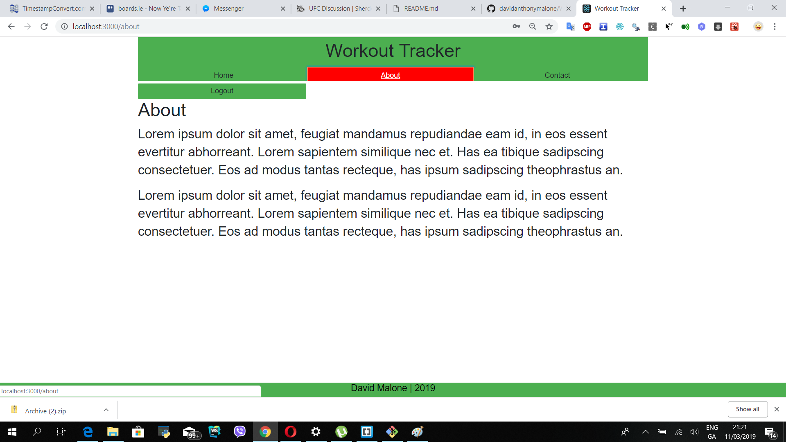
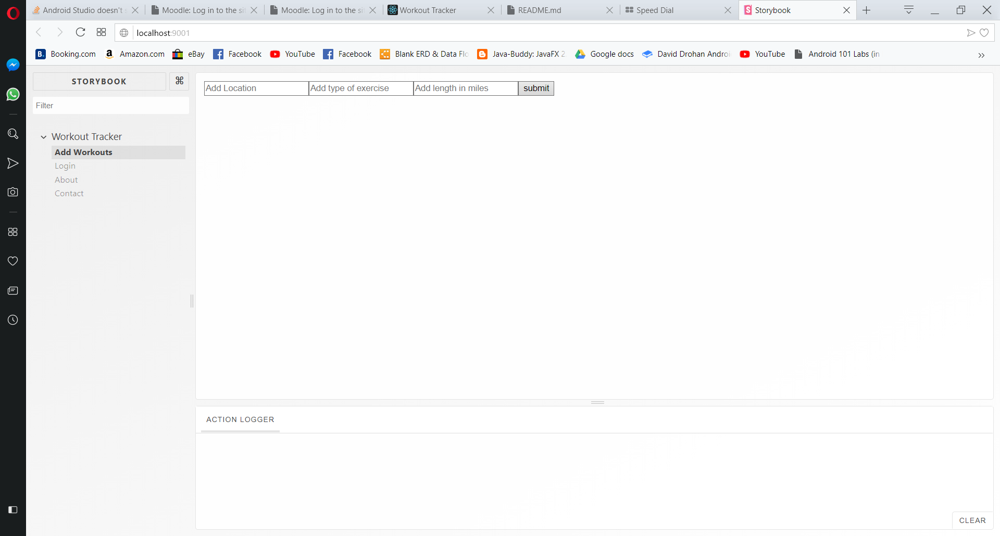

## Authors

@David Malone
@Student Number 20050617
davidanthonymalone@gmail.com if you have any questions.

# Workout Tracker Overview

The purpose of this application is for users to login to the application with their Google account and keep track of their exercises.  This is an exercise tracker. The data is not persisted but there is Create, Retrive and Delete functionality data from the view but when you reload the page everything is lost.

This application has 4 pages and 3 routes. There is one data model within this application and that is Workouts.  

## Data Model Design.
I have one data model and its a fairly simplistic workout data model.

 {
                "id": 1,
                "location": "Waterford",
                "type": "walking",
                "length": "1 miles"
 }

## Description

This application is built with React and it allows users to signup and login using their google accounts and to add exercises.  There is no persistence in this application at this time.  The exercises stub exercises are being fed in from a JSON file using a get method from a JSON file on my github (this is done using a npm package called axious.)

The application is styled partly using bootstrap and partly with custom css.

## Heroku Link
https://workouttracker0203.herokuapp.com/

### Dependencies

In the making of this application I used Firebases API for google sign in and Heroku for cloud deployment.

## UI Design.
<h2>Login</h2>

This is the signup and login which is created using Firebase Authentication.  The rest of the pagese can not be viewed unless you login first.  To sign up simply enter an email address and password and press the sign up button and then login.

<h2>Home</h2>

This page displays all the workouts that the user has from a placeholder json file.  The user can add a new workout and delete a workout.  There is no persistence and all the data is only session based, once the page is reloaded so is the data.

<h2>Contact</h2>

This is where you can contact the app owner about any potential problems

<h2>About</h2>

This is the about me page for the app owners.

## Routing
/Login
/Home
/Contact
/About

All routes require you to be logged in first.

### Installing
N/A

## App Component Design.

### Executing program

Run npm start

## Extra features
Firebase authentication and login && the application is deployed to the cloud using heroku:
https://workouttracker0203.herokuapp.com/

## Independent learning.

The indepenent learning would be the Firebase intergration and the Heroku deployment.  Also there is another few small things like uuid, axios etc.

